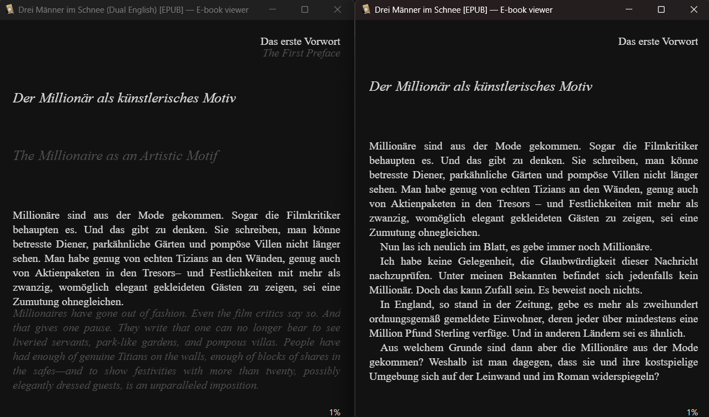

# EPUB Dual Language

A Python CLI that turns an EPUB into a dual-language EPUB using OpenRouter.

The default output is paragraph aligned:

```text
Original paragraph
Translated paragraph
```

This tends to work well for novels and essays because both languages stay close together without interrupting every sentence.

## Features

- Translates EPUB books with OpenRouter chat models.
- Preserves the original EPUB container and stylesheet links.
- Produces a separate dual-language edition with updated title and EPUB identifiers.
- Supports paragraph or sentence interleaving.
- Supports chapter-based or token-budget chunking.
- Can translate only the beginning of a book for quick tests.
- Can add rare bracketed translator notes for important cultural or archaic references.

Example of a generated dual-language EPUB (left) vs. original (right) opened in Calibre:



## Installation

Clone the repository and install it into a Python environment:

```bash
pip install -e ".[dev]"
```

Python 3.10 or newer is required.

Create a `.env` file:

```env
OPENROUTER_API_KEY=your_openrouter_key
```

`.env` is ignored by git.

## Basic Usage

```bash
epub-dual-language "path/to/book.epub" "English"
```

Write to a specific output path:

```bash
epub-dual-language "path/to/book.epub" "English" --output "output/book.dual.epub"
```

Translate only a small beginning sample:

```bash
epub-dual-language "path/to/book.epub" "English" --limit-units 30 --output "output/sample.dual.epub"
```

Run without calling OpenRouter:

```bash
epub-dual-language "path/to/book.epub" "English" --dry-run --limit-units 20
```

## Options

```bash
epub-dual-language INPUT_EPUB TARGET_LANGUAGE \
  --source-language German \
  --model google/gemini-3-flash-preview \
  --chunking tokens \
  --max-tokens 6000 \
  --layout paragraph \
  --translation-style italic \
  --translator-notes \
  --limit-units 40 \
  --output output/sample.dual.epub
```

## Metadata

The generated EPUB is marked as a separate dual-language edition.

For example, an input title like:

```text
Original Title
```

becomes:

```text
Original Title (Dual English)
```

The OPF unique identifier is also replaced with a new deterministic dual-edition UUID. This reduces the chance that Calibre or an e-reader treats the translated edition as the same book as the source.

## Chunking

`--chunking tokens` is the default. It walks the EPUB in reading order and packs paragraphs or sentences into model requests until the estimated `--max-tokens` budget is reached. Small samples can therefore fit into a single API call even if they cross EPUB file boundaries.

`--chunking chapters` sends one EPUB spine document at a time. Many EPUBs store chapters as separate XHTML files, so this often approximates chapter-by-chapter translation. It is simple, but very long chapters can create large requests.

Token counts are estimates based on text-like tokens, not provider billing tokens.

## Layouts

`--layout paragraph` is the default and recommended mode for reading:

```text
Original paragraph
Translated paragraph
```

`--layout sentence` alternates original and translated sentences inside each paragraph. It can be useful for language study, but it is less pleasant for uninterrupted reading.

## Translation Styling

Translated text is italic by default so it is easy to distinguish from the original without changing the book too aggressively.

```bash
epub-dual-language "path/to/book.epub" "English" --translation-style italic
```

Available styles:

- `italic`
- `muted`
- `italic-muted`
- `plain`

## Translator Notes

Use `--translator-notes` to let the model add rare, short notes in square brackets for genuinely important archaic, historical, or culturally specific references:

```bash
epub-dual-language "path/to/book.epub" "English" --translator-notes
```

The prompt explicitly asks the model not to explain ordinary lines or add notes everywhere.

## Development

Run tests:

```bash
pytest
```

Run the CLI module directly:

```bash
python -m epub_dual_language.cli "path/to/book.epub" "English" --dry-run --limit-units 10
```
